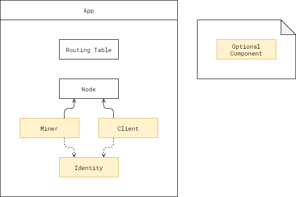
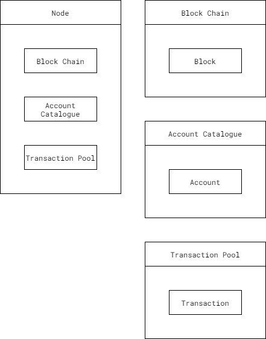
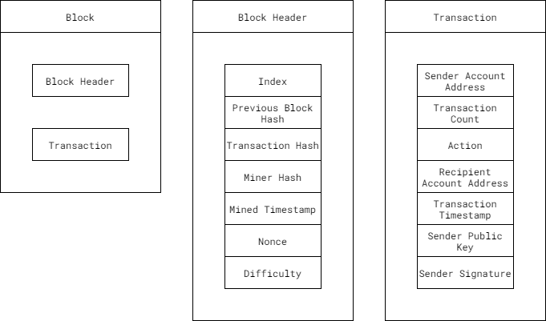
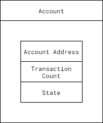

# Architecture

## `App`

Overall structure of the program. Handles initializing and
maintaining/running components.

* `RoutingTable`
  - Used for networking.
* `Node`
  - The central component of the system.
  - Acts more like a passive entity, akin to a data structure. Fully
    self contained. Throws `Exception`s when necessary, but does not actively
    initiate a function from `App`.
* `Miner`
  - Optional runnable component.
  - Responsible for mining `Block`s.
* `Client`
  - Optional runnable component.
  - Responsible for generating `Transaction`s.
* `Identity`
  - Optional required compoent. Needed when `App` runs as a `Miner` and/or
    a `Client`.

When run with all possible components, three running threads are spawned,
`App`, `Miner`, and `Client`. For each entity, its interaction with the `Node`
is controlled by an `interface`.

## `Node`

## `Block`

## `Account`

